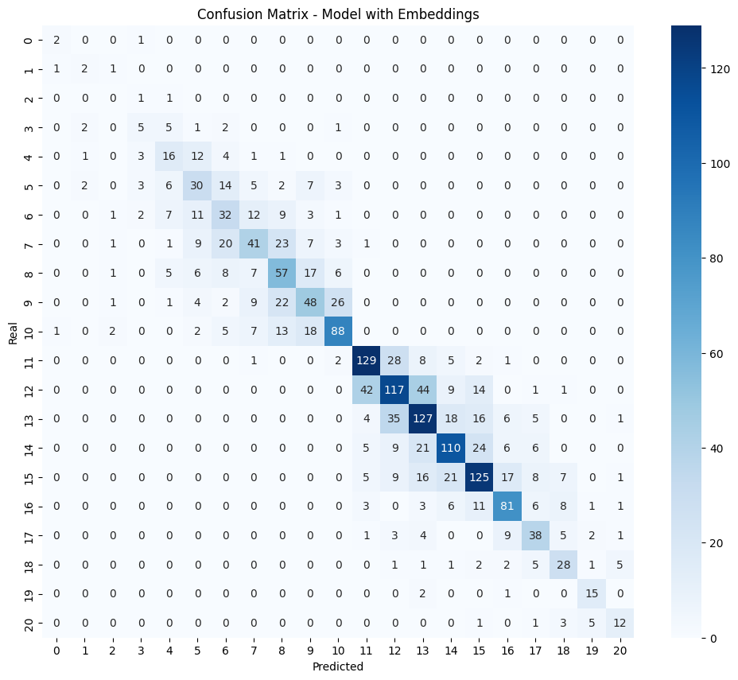

# Multiclass Corporate Credit Rating

A machine learning project that predicts corporate credit ratings using financial metrics. The project tackles a real-world imbalanced multiclass classification problem, classifying companies into 20 distinct credit rating categories (e.g. AAA, AA+, BBB−) based on publicly available financial data.

## Table of Contents

- [Overview](#overview)
- [Dataset](#dataset)
- [Methodology](#methodology)
- [Models & Results](#models--results)
- [Project Structure](#project-structure)
- [Getting Started](#getting-started)
- [Dependencies](#dependencies)

## Overview

Credit ratings assigned by agencies such as Standard & Poor's, Moody's, and Fitch are critical signals for investors and debt issuers. This project explores whether those ratings can be predicted automatically from a company's financial indicators.

**Key challenges addressed:**

- **Imbalanced classes** — rating categories are not equally represented in the data.
- **High cardinality text features** — corporation names encoded with sentence-level BERT embeddings.
- **Metric selection** — strict accuracy is misleading for ordinal multiclass targets; MAE and top-*k* accuracy are used alongside it.

## Dataset

| Property | Value |
|---|---|
| File | `data/ccr.csv` |
| Records | 7,805 |
| Missing values | None |
| Rating agencies | Standard & Poor's, Moody's, Fitch |
| Date range | 2010 – 2016 |

### Features

**Categorical:** Rating Agency, Corporation, Ticker, Sector, SIC Code, Rating Date, CIK

**Financial metrics (18 numerical features):**

| Category | Features |
|---|---|
| Liquidity | Current Ratio |
| Leverage | Long-term Debt/Capital, Debt/Equity Ratio |
| Profitability | Gross Margin, Operating Margin, EBIT Margin, EBITDA Margin, Pre-Tax Profit Margin, Net Profit Margin |
| Efficiency | Asset Turnover |
| Returns | ROE, Return on Tangible Equity, ROA, ROI |
| Cash Flow | Operating Cash Flow Per Share, Free Cash Flow Per Share |

**Target variable:** `Rating` — 20 ordinal classes (AAA → BBB− and below)

## Methodology

### Preprocessing

1. **BERT embeddings** — corporation names are encoded with `all-MiniLM-L6-v2` and then reduced to 10 components with UMAP.
2. **Ordinal encoding** — categorical features are encoded respecting the implicit ordering in credit ratings.
3. **Standard scaling** — all 18 financial metrics and the 10 UMAP components are standardised.

### Handling Class Imbalance

Four resampling strategies were evaluated:

- `RandomOverSampler`
- `SMOTE`
- `SMOTEENN` (SMOTE + Edited Nearest Neighbours)
- `SMOTETomek` (SMOTE + Tomek links)

The best model ultimately performed better **without any oversampling**.

### Class Merging

To provide an upper-bound evaluation, the 20 original classes were merged into 6 tiers:

| Tier | Ratings |
|---|---|
| 6 | AAA – AA |
| 5 | AA− – A+ |
| 4 | A |
| 3 | A− – BBB+ |
| 2 | BBB |
| 1 | BBB− and below |

### Hyperparameter Optimisation

[Optuna](https://optuna.org/) with `MedianPruner` was used for efficient trial pruning during hyperparameter search.

## Models & Results

### Model Comparison

| Model | Notes |
|---|---|
| Logistic Regression | L1/L2 regularisation |
| Support Vector Classifier | — |
| **Random Forest** ✅ | **Best performer** |
| Decision Tree | — |
| HistGradientBoosting | — |
| AdaBoost | — |
| VotingClassifier | Ensemble of multiple models |

### Best Model — Random Forest

**Optimised hyperparameters (Optuna):**

```
n_estimators      : 500
max_features      : sqrt
max_depth         : 40
min_samples_split : 6
min_samples_leaf  : 3
criterion         : entropy
```

### Performance

| Problem | Metric | Score |
|---|---|---|
| 20-class | Accuracy (2-fold CV) | 0.52 |
| 20-class | F1-score | 0.52 |
| 20-class | MAE | 0.77 |
| 20-class | Top-2 accuracy | 0.77 |
| 6-class (merged) | Accuracy | > 0.90 |

> **Note:** An MAE of 0.77 means the model's predictions are typically off by less than one rating notch, which is a strong result given the ordinal nature of credit ratings.

### Confusion Matrix



## Project Structure

```
Multiclass-Corporate-Credit-Rating/
├── data/
│   └── ccr.csv                                        # Dataset (7,805 records)
├── img/
│   └── confusion_mat.png                              # Confusion matrix
├── src/
│   ├── Multiclass_Corporate_Credit_Rating_D1_2.ipynb  # Main analysis notebook
│   ├── Analysis of the dataset.ipynb                  # Exploratory data analysis
│   ├── optuna_journal.log                             # Optuna trial logs
│   └── optuna_study.db                               # Optuna study database
├── requirements.txt
└── README.md
```

## Getting Started

1. **Clone the repository**

   ```bash
   git clone https://github.com/DiegoLopezAroca/Multiclass-Corporate-Credit-Rating.git
   cd Multiclass-Corporate-Credit-Rating
   ```

2. **Install dependencies**

   ```bash
   pip install -r requirements.txt
   ```

3. **Run the notebooks**

   Start with the exploratory analysis, then open the main deliverable:

   ```bash
   jupyter notebook "src/Analysis of the dataset.ipynb"
   jupyter notebook src/Multiclass_Corporate_Credit_Rating_D1_2.ipynb
   ```

## Dependencies

Key libraries (see `requirements.txt` for full list and versions):

| Library | Purpose |
|---|---|
| scikit-learn | ML models and preprocessing |
| imbalanced-learn | Oversampling strategies |
| sentence-transformers | BERT-based text embeddings |
| umap-learn | Dimensionality reduction |
| optuna | Hyperparameter optimisation |
| pandas / numpy | Data manipulation |
| matplotlib / seaborn | Visualisation |
